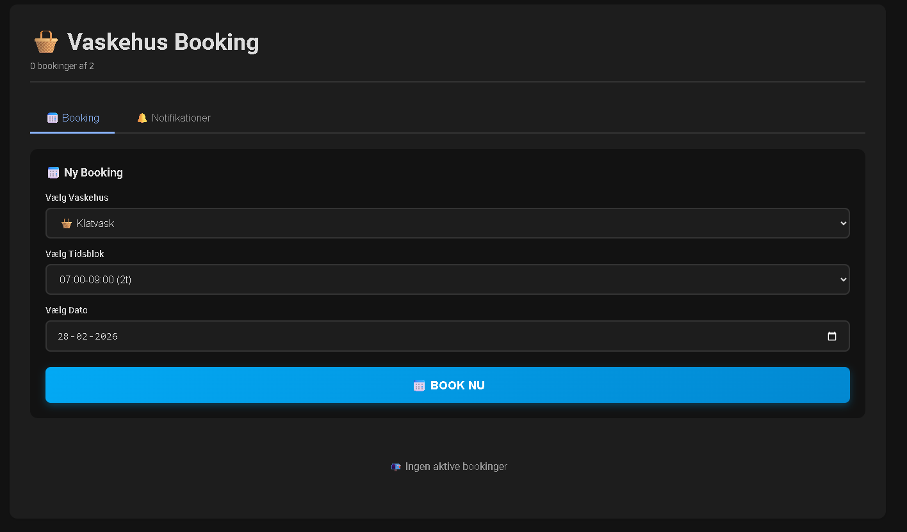
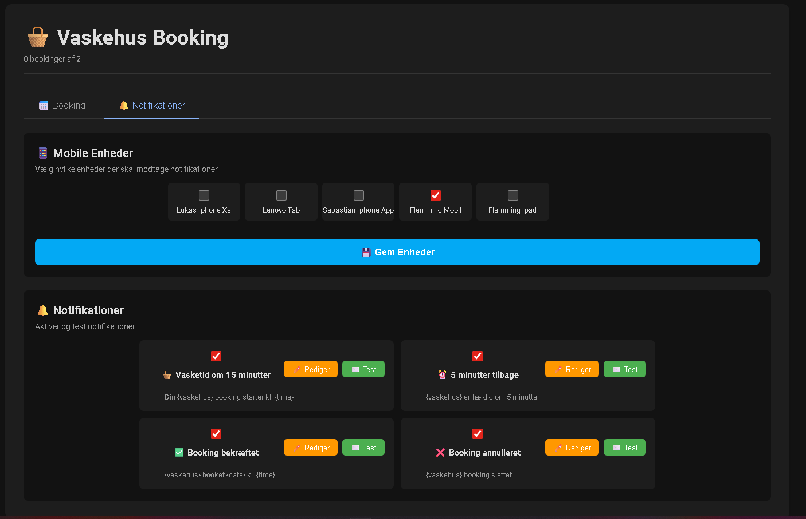
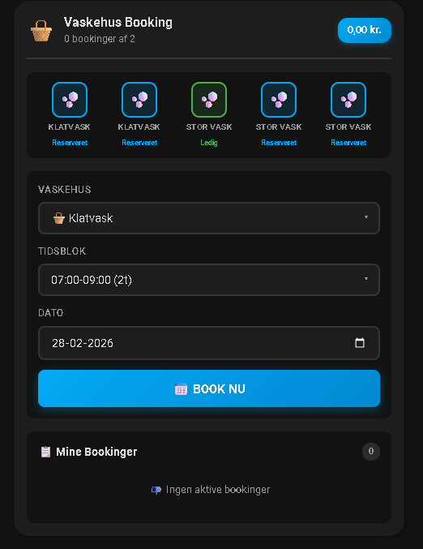
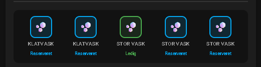

# MieleLogic — Home Assistant Integration

[](https://github.com/kingpainter/mielelogic/releases)
[](https://github.com/hacs/integration)
[](LICENSE.md)
[](https://www.home-assistant.io/)

Home Assistant integration til MieleLogic vaskehus-systemer. Book vasketider, overvåg maskiner i realtid og modtag notifikationer direkte på mobilen — alt fra Home Assistant.

> **Krav:** Home Assistant Core 2026.1.0 eller nyere.

---

## Hvad kan det?

**Booking** — Book Klatvask eller Storvask direkte fra et panel i sidebaren eller fra et Lovelace-kort. Systemet bruger stednavne fremfor maskinnumre, så det er intuitivt for alle i ejendommen.

**Maskinestatus** — Se i realtid om maskinerne er ledige, i gang, reserverede eller lukkede. Vises som farvede ikoner øverst i booking-kortet.

**Notifikationer** — Modtag push-beskeder på mobilen ved booking, aflysning og som påmindelser 15 og 5 minutter før din tid starter. Beskedskabelonerne kan tilpasses.

**Kalender** — Bookinger synkroniseres automatisk til Home Assistants kalender med vaskehusnavne fremfor maskinnumre.

**Admin** — Driftsbesked til alle brugere og mulighed for at spærre for nye bookinger midlertidigt.

**Statistik** — Se de seneste 30 dages afsluttede bookinger med brugernavn og varighed.

---

## Screenshots

| Panel — Booking | Panel — Notifikationer |
|---|---|
|  |  |

| Lovelace Card | Maskinestatus |
|---|---|
|  |  |

---

## Installation

### Via HACS (anbefalet)

1. Åbn HACS → Integrationer → Tilpassede repositories
2. Tilføj: `https://github.com/kingpainter/mielelogic`
3. Søg efter "MieleLogic" og installer
4. Genstart Home Assistant

### Manuel installation

1. Download seneste release fra GitHub
2. Kopier mappen `custom_components/mielelogic/` til din HA `config/custom_components/`
3. Genstart Home Assistant

### Opsætning

1. Indstillinger → Enheder og tjenester → Tilføj integration → søg "MieleLogic"
2. Indtast dine MieleLogic loginoplysninger
3. Konfigurer maskiner og tidslots
4. Panelet vises automatisk i sidebaren

### Lovelace-kort

Tilføj til dit dashboard:

```yaml
type: custom:mielelogic-booking-card
```

Ingen yderligere konfiguration nødvendig.

---

## Versionskrav

| Komponent | Minimumversion |
|---|---|
| Home Assistant Core | 2026.1.0 |
| HA Companion App (notifikationer) | Seneste |
| Python | 3.11+ |

---

## Filstruktur

```
custom_components/mielelogic/
├── __init__.py                 # Integration setup
├── manifest.json               # Metadata
├── const.py                    # Konstanter
├── config_flow.py              # Konfigurationsflow + genkonfiguration
├── coordinator.py              # Dataopdateringer
├── diagnostics.py              # Debug-eksport
├── sensor.py                   # 5 sensorer
├── binary_sensor.py            # 6 binary sensorer
├── calendar.py                 # Kalenderintegration
├── services.py                 # Book/aflys services
├── panel.py                    # Panelregistrering
├── time_manager.py             # Tidsslotslogik
├── booking_manager.py          # Bookingoperationer + brugertracking
├── websocket.py                # 17 WebSocket-kommandoer
├── storage.py                  # Persistent lagring
├── notification_manager.py     # Rige notifikationer
├── frontend/
│   ├── entrypoint.js
│   ├── panel.js                # Sidebarpanel (4 tabs)
│   └── mielelogic-booking-card.js  # Lovelace-kort
└── translations/
    ├── da.json
    └── en.json
```

---

## WebSocket API

Integration eksponerer 17 WebSocket-kommandoer:

```
Booking:        get_slots · make_booking · cancel_booking · get_bookings · get_status · get_machines
Notifikationer: get_devices · save_devices · get_notifications · save_notification · test_notification · reset_notification
Admin:          get_admin · save_admin
Statistik:      get_history · cleanup_history
```

---

## Kendte begrænsninger

- Kun én vaskehus-instans understøttes (multi-vaskehus planlagt til v3.0.0)
- Kalenderbegivenheder slettes ikke automatisk ved aflysning (planlagt v2.1.0)
- Panelet kræver internetadgang til LitElement CDN (cdn.unpkg.com)

---

## Fejlfinding

**Panel vises ikke**
Ryd browsercache (Ctrl+Shift+R). Panelet registreres ved HA-genstart.

**Notifikationer virker ikke**
Panel → Notifikationer → Kontroller at enheder er valgt og notifikationer er aktiveret. HA Companion-appen skal have tilladelse til notifikationer.

**"Ikke klar"-fejl i notifikationsfanen**
Opdater til v1.9.1 — denne fejl blev rettet i `websocket.py`.

**Kalender-fejl ved opstart**
Kræver Home Assistant 2026.1.0+. Ældre versioner mangler `calendar.create_event`-servicen.

---

## Roadmap

Se [STATUS.md](STATUS.md) for detaljeret plan.

- **v2.0.0** ✅ — Admin-tab, statistik, Gold tier EntityDescription
- **v2.1.0** — Kalender-cleanup ved aflysning, Gold tier tests
- **v3.0.0** — Multi-vaskehus, aflys booking fra notifikation

---

## Bidrag

Pull requests er velkomne. Se [CONTRIBUTING.md](CONTRIBUTING.md) for retningslinjer.

---

## Licens

MIT — se [LICENSE.md](LICENSE.md)

---

**Seneste version:** 1.9.1 — 28. marts 2026  
**Udvikler:** KingPainter  
**Sprog:** Dansk / Engelsk
